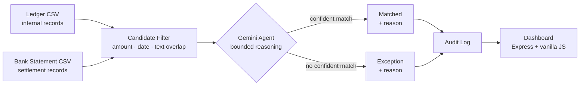

# ClearLedger

**Bounded, explainable AI reconciliation — every decision logged, no silent matches.**

Built for the Razorpay AI Buildathon — AI Finance Controller track.


## The problem

Every business that moves money through multiple systems — an internal ledger and a bank or payment gateway statement — faces the same recurring, manual task: **does what we think happened actually match what happened?**

Settlement delays, bank fees, garbled narrations, and partial payments mean the two records rarely line up 1:1. Today this reconciliation is usually done by a human comparing two spreadsheets by eye.

ClearLedger is an agent that reconciles two financial record sources and, for every transaction, either:
- confidently **matches** it to its counterpart, with a stated reason, or
- flags it as an **exception** — with a reason a human can act on.

It never silently guesses. Every decision is logged with the evidence considered, so the output is auditable end to end. A false match is worse than a correctly-flagged exception — this shaped every design decision below.

---

## Architecture



**Why two stages, not one:**
- **Candidate filter** (cheap, deterministic): narrows ~50 ledger rows down to the 5 most plausible matches per bank row, using amount closeness, date closeness, and narration token overlap. No API cost, no LLM latency.
- **Gemini reasoning** (the actual judgment call): only sees the narrowed candidate list, never the full ledger. This bounds the model's task — pick one of these 5, or say none — which keeps the failure mode safe: worst case is an unnecessary exception, never a false match to something it was never shown.

This mirrors the retrieval-then-reason pattern used in [CodeChat](../codechat) (a prior RAG project), applied here to structured transaction data instead of text chunks.

---

## Results

Evaluated on a 50-row synthetic dataset (see [Dataset](#dataset) below) against a held-out ground-truth mapping the pipeline never sees:

| Metric | Value |
|---|---|
| Match rate | 88% |
| Precision | 100% |
| Recall | 100% |
| False positives (wrong matches) | 0 |
| False negatives (missed real matches) | 0 |
| Exceptions correctly flagged | 12 / 12 |

**What this means:** every one of the 44 genuine matches was found correctly, zero incorrect matches were made, and both types of orphaned transactions (a bank entry with no ledger record, and a ledger entry with no bank record) were correctly caught rather than force-matched or silently dropped.

---

## Dataset

Since real transaction data isn't available (and using someone else's would raise privacy concerns), the dataset is synthetically generated with deliberately realistic noise:

- **55%** exact matches
- **20%** date-lag matches (1–3 day settlement delay)
- **13%** amount-mismatch matches (bank/gateway fee deducted)
- **12%** garbled-narration matches (abbreviated bank text, e.g. `RED PHA` for `Redwood Pharma`)
- **12 orphans** — 6 with no bank counterpart, 6 with no ledger counterpart

Generator: [`data/generate_data.js`](data/generate_data.js), seeded for reproducibility.

---

## Features

- Two-stage matching pipeline (candidate filter + Gemini reasoning)
- Full audit trail — every decision logged with the candidates considered and the reason given
- Precision/recall scoring against ground truth
- Dashboard: filterable transaction table, click-to-expand detail view (ledger vs. bank side-by-side, confidence score, "How ClearLedger decided" reasoning breakdown)
- Live "Run reconciliation" trigger from the dashboard
- Markdown report generator for reviewer-readable evidence

---

## Tech stack

- **Backend:** Node.js, Express
- **Matching logic:** custom candidate filter (no external libraries) + Gemini API (`gemini-3.5-flash-lite`)
- **Frontend:** vanilla HTML/CSS/JS (no framework)
- **Data:** CSV, no database — pipeline output is JSON

---

## Running it locally

```bash
git clone https://github.com/monika-gp/clearledger.git
cd clearledger/backend
npm install

# Create backend/.env with your own key:
# GEMINI_API_KEY=your_key_here

node runReconciliation.js    # ~4 min, respects free-tier rate limits
node generateReport.js       # optional: produces RECONCILIATION_REPORT.md
node server.js               # dashboard at http://localhost:3001
```

---

## Known limitations

- Evaluated on a 50-row synthetic dataset with well-separated noise categories. Real-world data at larger scale, with overlapping ambiguity between candidates, would likely show lower precision/recall than reported here.
- The candidate filter caps at 5 candidates per bank row; a true duplicate-invoice scenario (two ledger entries with near-identical amount and date) isn't explicitly tested.
- Single-currency, single-bank-account. Multi-currency or multi-account reconciliation would need additional disambiguation signals.
- Gemini free-tier rate limits (15 requests/minute) mean a full run takes ~4 minutes; a production version would need a paid tier or batching for real-time use.

---

## Project structure

```
clearledger/
├── backend/
│   ├── candidateFilter.js      # Stage 1: cheap deterministic narrowing
│   ├── geminiMatch.js          # Stage 2: LLM reasoning + decision
│   ├── runReconciliation.js    # orchestrates the full pipeline
│   ├── generateReport.js       # produces human-readable Markdown report
│   ├── server.js               # Express server + dashboard API
│   └── diagnoseFalseNegatives.js  # debugging tool used during development
├── frontend/
│   └── index.html              # dashboard (self-contained HTML/CSS/JS)
├── data/
│   ├── generate_data.js        # synthetic dataset generator
│   ├── ledger.csv / bank_statement.csv / ground_truth.csv
│   └── output/                 # pipeline results (matches, exceptions, audit log, metrics)
└── README.md
```